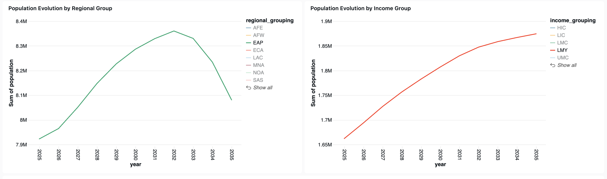
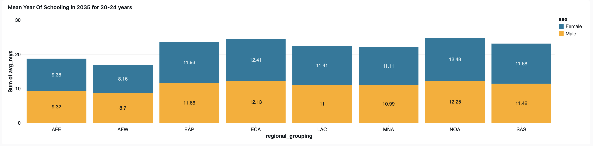
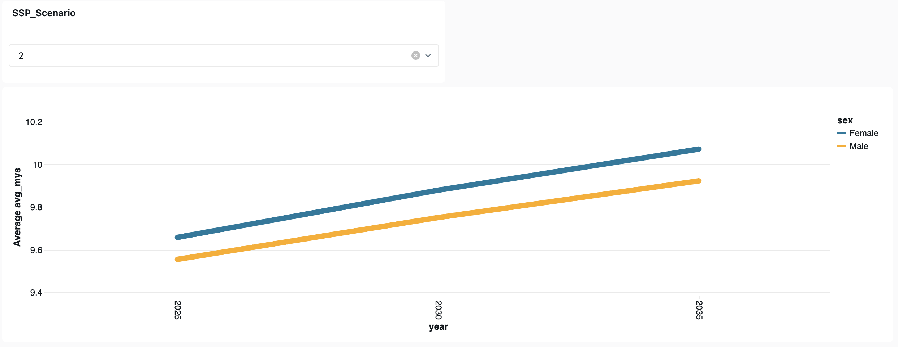
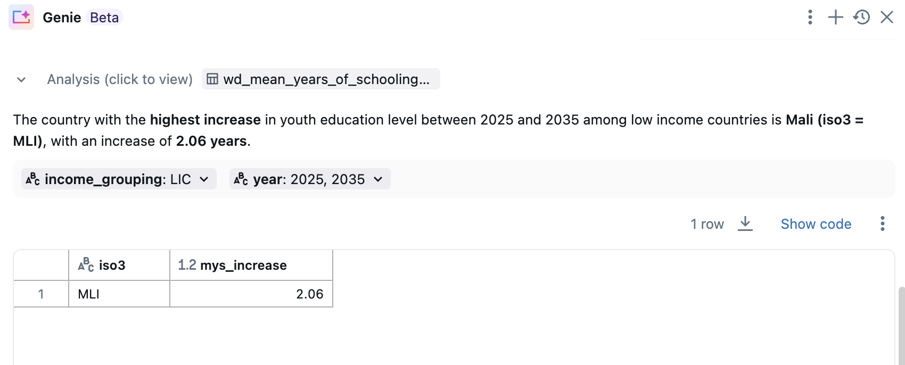

# Edu Insights
 
## Overview
 
Team Edu_Insights built an AI/BI dashaboard to vizualize how the changes in educational composition of young people (15-24) in (today’s) non-high-income countries between 2025 and 2035.  
 
## Team Members
 
- Linh Nguyen
- Mbaye Diongue
- Auriane Maymard
 
 
## Challenge Category Area
 
Category III: Jobs & Youth. Explore the future of the world’s youngest workforce: their education levels, their readiness for AI, and the skills that will shape prosperity in 2035. Reveal which countries are racing ahead and which risk being left behind. Build bold, data-driven narratives that illuminate the opportunities and vulnerabilities facing a generation.
 
Challenge 6: Exploring the future of education & jobs: what youth skills will matter most in 2035? Track how youth education levels (15–24) will shift by 2035 across countries and scenarios, and what this implies for future skills, gender gaps, and regional winners & who may fall behind.
 
CONTEXT: The world’s young people (ages 15-24) are the workforce, entrepreneurs, and leaders of tomorrow. But how educated will they be? Where will academic skills improve most dramatically, and where might population growth outpace educational gains? We are trying to unearth insights from future scenarios.
 
https://www.dc2.org/datadive
 
## Project Description
 
Team Edu_Insights built an AI/BI dashaboard to vizualize how the changes in educational composition of young people (15-24) in (today’s) non-high-income countries between 2025 and 2035.
The tool will allow users to see the trends in youth education levels and help identify the countries that will see the most dramatic improvements.
 
The application is designed to be user-friendly, with interactive visualizations that allow users to filter data by country, scenario, region and income grouping.
It also includes an AI component that users can interact with in natural language to get even deeper in the data.

## Genie: AI chatbot to deep dive
Our dashboard comes with an AI assistant that answers questions on the data.

 
 
## Links:
 
To be shared later
